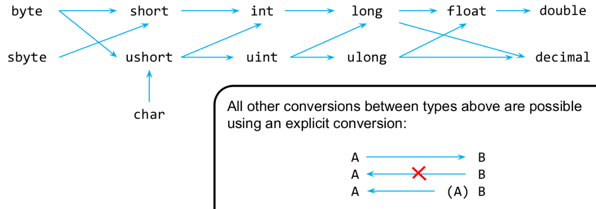
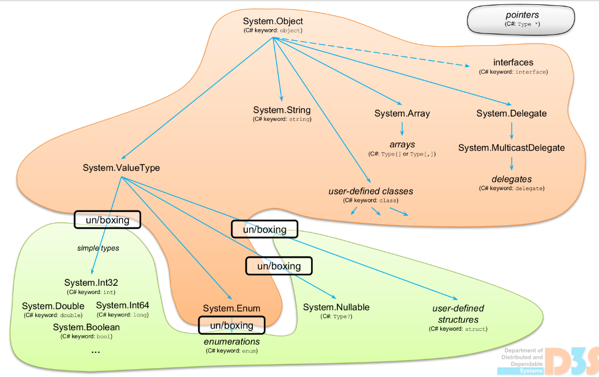

## Implicitini konverze



Pozor, to ze mezi necim existuje implicitni koverze neznamena, ze to nejak od sebe dedi!!!

U te implicitni konverze na float/double se muze ztratit presnost. Neexistuji implicitni konverze s bool.i



```c#
int a = 5;
object b = a; // implicitni konverze
```

Musi se to boxovat.

## Explicitni konverze

```c#
string s = (string) o; // explicitni konverze
```

Musi se overit, ze v tom objectu je promenna typu string --> Runtime Check.
Kdyz to nejde, tak to hodí InvalidCastException.

## Extension metody pro komverzi

```c#
struct Fraction {
    int num;
    int denum;
    public double ToDouble() => (double)num/denum;
}

static class DoubleExtensions {
    public static Fraction ToFraction(this double d) {
        // vyrobi a vrati novou instanci Fraction
    }
}
```

## Přetěžování operátorů

```c#
struct Fraction {
    int num
    int denum
    public double ToDouble() => (double)num/denum;

    // implicitni konverze int na Fraction
    // parametr = zdrojovy typ, Nazev = cilovy typ
    public static implicit operator Fraction(int n) {...}
}

```

Podobne jako `implicit` existuje i `explicit` konverze.

## Method overloading

Více metod se stejným názvem, ale různým počtem / typem parametrů.

```c#
class A {
    public void f(int i) {...}
    public void f(double d) {...}
}

class B : A {
    public void f(long l) {...}
}

B b = new B();
b.f(1); // volá se f(long l), protoze existuje implicitni konverze int --> long
```

To jaka metoda se vola se urci uz za prekladu.

Jak se hledají metody:

- nejprve s kontextu aktualni tridy (B)
- pokud bych nenasel nic vhodneho, tak v predkovi (A)
- f(int) je sice vhodnejsi, ale f(long) jde s implicitni komverzi a neni v predkovi

Obecne

- pokud si muzu vybrat mezi vice implicitnimi konverzemi, tak zvolim tu nejprimejsi.
- pokud existuje uzivatelsky definovana implicitni konverze, tak se taky bere v uvahu
- ale v tom retezci konverzi muze byt pouze jedna uzivatelem definovana konverze
- pokud jsem nenasel zadnou vhodnou konverzi, tak se posunu o kontext vyse a zkousim znovu

## Genericke metody

```c#
class A {
    public T Max<T>(T a, T b) where T : IComparable<T> {
        return (a.CompareTo(b) > 0) ? a : b;
    }
}
```

Genericka metoda zustava generickou i na urovni CIL kodu. A az pri volani vyrobi JIT za run-time specializovanou verzi pro konkretni typ. PRO KAZDY TYP JE NOVA IMPLEMENTACE!

```c#
class A {
    public void f<T>(T a) {...}
    public void f(float a) {...}
}

class B : A {
    public void f(long a) {...}
}
```

Algoritmus je porad stejny, nejprve hledam v aktualnim kontextu. Kdyz nic nenajdu, tak jdu dal. Preferuje se genericky typ pred implicitni konverzi.

```c#
B b = new B();
b.f(1);         // B.f(long)
b.f(1l);        // B.f(long)
b.f(1.0f);      // A.f(float)
b.f(1.0);       // A.f<double>
b.f("hello");   // A.f<string>
```

Typy parametru se mohou matchovat i pro genericke metody. Takze muzu mit

```c#
class A {
    public void f<T1, T2>(T1 a, T1 b, T2 c) {...}
}

// Muzu udelat explicitne btw
f<int, long>(...)
// Nebo implicitne a ono to bude delat implicitni konverze (stale plati max jedna uzivatelska)
f(1, 2l, "hello");  // f<long, string>
```

Takze recap:

- za prekladu do CIL kodu se voli, jaka metoda se bude volat. Jestli genericka / negenericka je jedno, proste jaka metoda a da se do toho CIL kodu instrukce call / callvirt
- pokud se vybere genericka, jak JIT za run-time vyrobi specializaci pro konkretni typ

Genericke metody mohou byt virtualni, pak overload zase musi byt genericka metoda.

### Klicove slovo dynamic

Duck typing na urovni pythonu. Jako parametr metoda dam treba `f(dynamic x)` a pak na `x` muzu volat vse a dela se runtime check jestli ta metoda existuje. Prelozi se jako object ale da se na ni volat vsechno.

### Klicove slovo where

```c#
void m<T>(T x) where T : IComparable<T>, dalsi podminky {...}
```

Specialni podminky jsou (ty nejdulezitejsi):

- class: T musi byt referencni typ
- struct: T musi byt hodnotovy typ
- new(): T musi mit bezparametricky konstruktor

## Interface parametr vs Genericka metoda

```c#
interface I1 {
    void f();
}

struct S : I1 {
    void f() {...}
}

class A {
    void f(I1 x) {...}
    void g<T>(T x) where T : I1 {...}
}
```

Interface je referenci takže když metoda bere interface a predam tam nejaky struct, tak se musi boxovat.

Ale genericke metody se vždy dělají znovu speciálně, takže pro ten struct se to udělá nova specializace `g<S>(...)` a nebude se nic boxovat.

Ale typicky preferujeme metodu s interfacovym parametrem, je to citelnejsi.

## Genericke typy

Za compile-time se generuje jeden genericky CIL kod, JIT pak dela specializace. Kazda specializace ma vlastni class constructor a staticke fieldy.

Dedicnost: Specializace generickeho typu jsou ve stromu dedicnosti nezavisle na sobe.

Funguje to tak, jak by clovek cekal, priklady kdyztak v souboru o C# generickych [collections](enumeratory.md).
